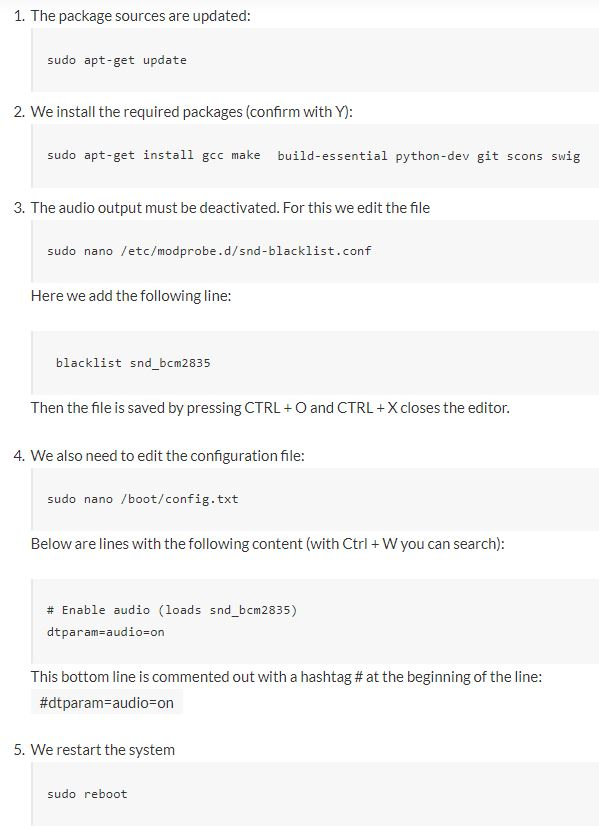

# ScreenLed

## Messy collection of attemps to sync video/screen content to argb led strip
1. [pc](pc)
    - Original "live" python solution and preprocess mode implemented in python
    - Live mode takes screenshots and sends results out through UDP (works ok on powerful hw, not so much on anything else)
    - Preprocess mode works so that [tools/preprocess_video.py](tools/preprocess_video.py) is used to create pickle dump from a video and then [pc/preprocess_videoplayer.py](pc/preprocess_videoplayer.py) is used to play video in vlc. This script reads rgb information from the pickle dump and sends that instead of doing any realtime processing. Doesn't work very well because for long videos this uses a LOT of memory and due to python being slow everything tends to go out of sync etc.
2. [ScreenLedLib](ScreenLedLib) and [ScreenLedGUI](ScreenLedGUI)
    - Original "live" solution rewritten in c++ and gui to use it
    - Way better performance (actually quite usable on any reasonably good hw). [ScreenLedLib](ScreenLedLib) has the functionality for capturing screen content and calculating RGB values. [ScreenLedGUI](ScreenLedGUI) has a simple gui made with QT which uses the [ScreenLedLib](ScreenLedLib). To use this "live c++" solution, build the ScreenLedGUI project.
3. [VideoCapture2LED](VideoCapture2LED)
    - WIP (probably never to be finished) implementation where you connect e.g. hdmi capture card to same raspi to which you have led strip connected to and it does all processing. Works but there tends to be too much delay when reading the stream from capture card -> not very usable.
4. [raspberry](raspberry)
    - Extremely poorly made scripts to run on raspberry to capture data over UDP and show on the rgb strip
    - [raspberry/raspb.py](raspberry/raspb.py) should be able to receive information from python live and preprocess implementations
    - [raspberry/raspb_cpp.py](raspberry/raspb_cpp.py) should be able to receive data from live c++ implementation
    - Both receivers are very crude implementations with hardcoded everything -> not very usable except in my specific setup :D

----Everything below is outdated and instructions to be moved to correct folders-----

## Live Mode

### Description
Simple program to control addressable rgb strip based off of what's visible on screen. Values in the raspberry pi code (raspb.py) most likely require some tweaking before this works (amount of leds...). Relevant settings for pc side should be configurable through the gui.

### Demo
Demo video of this running with some music videos here: https://youtu.be/UZCBObS5qF0

### Usage
1. Disable audio on your raspberry pi:

2. Run rasb.py on raspberry pi with led-strip connected like this:

3. Run pc/gui.py on your computer
    - single threaded: "python gui.py"
    - multi threaded: "python gui.py multith"
    
    
## Preprocess Mode

### Description
Taking screenshots for analysis is rather slow on python so there is also another option to preprosess a video and play it through the script. This has greatly better performance on slow computers!

### Usage
1. Process a video file with pc/preprocess_video.py (this will create a python pickle dump of the led information to a file in the same folder as source with the same filename)
2. Run raspb.py
3. Play processed video with pc/preprocess_videoplayer.py (the pickle dump is attempted to be found in the same folder as video file)
